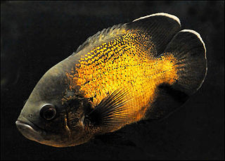
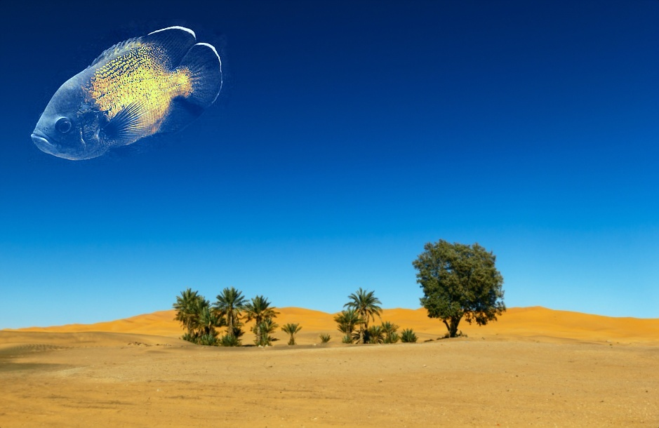
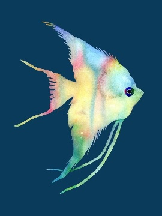

# Poisson-Blending
 Poisson Blending (poisson equation with dirichlet boundary conditions poisson blending)

Results: 

| Source | Target | Result |
| ------ | ------ | ------ |
|  |  |  |
|  |  |  |
|  |  |  |
|  |  |  |
|  |  |  |
|  |  |  |
|  |  |  |
|  |  |  |

