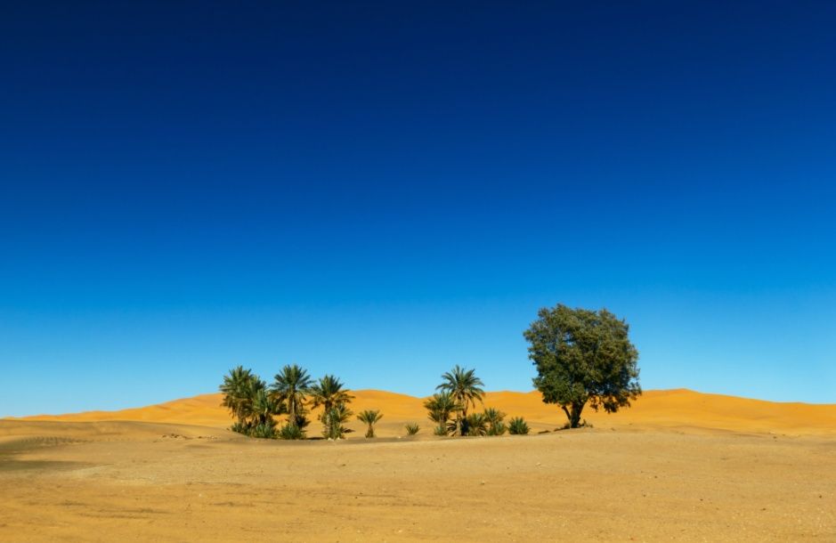

## Project Definition

In this project, with the help of **Solving Poisson Equation With Dirichlet Boundary Conditions By Numerical Solutions**, part of **Source** image
is blended into the **Target** image and the result of blending is given in the output.

Steps to solve **Poisson Equation With Dirichlet Boundary Conditions** numerically are as follows: 

### 1. **Poisson Equation With Dirichlet Boundary Conditions** is defined as follows:

### 2. **Laplacian Approximation** Based On Taylor Expansion

### 3. Problem Statement as a Matrix Equation

---
## Results

| Source | Target | Pyramid Blending Result
| ------ | ------ | ----- |
|  |  | |
|  |  | |
|  |  | |
|  |  | |
|  |  | |
|  |  | |
|  |  | |
|  |  | |